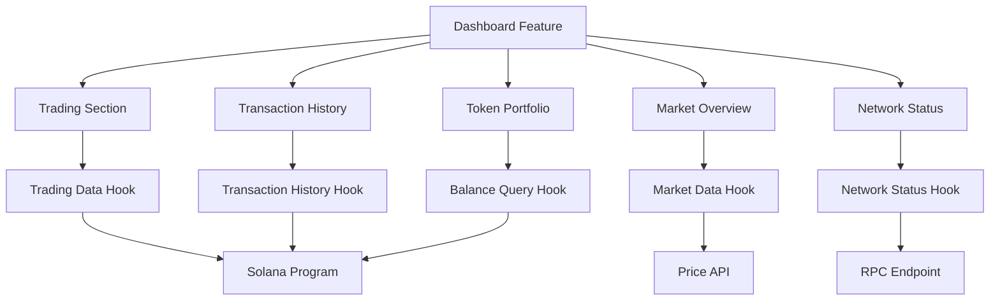

# Design Document

## Overview

The Trading Dashboard will be built as an enhanced version of the existing dashboard feature, integrating real-time trading functionality directly into the main dashboard interface. The design leverages the existing React/TypeScript architecture with Solana blockchain integration, using React Query for data management and shadcn/ui components for consistent styling.

## Architecture

### Component Structure
```
src/features/dashboard/
├── dashboard-feature.tsx (enhanced main component)
├── data-access/
│   ├── use-trading-data.ts (real-time trading data)
│   ├── use-market-data.ts (price and market info)
│   ├── use-transaction-history.ts (user transaction data)
│   └── use-network-status.ts (blockchain network info)
└── ui/
    ├── trading-section.tsx (buy/sell interface)
    ├── transaction-history.tsx (history table)
    ├── token-portfolio.tsx (token balances)
    ├── market-overview.tsx (price charts)
    └── network-status.tsx (network info widget)
```

### Data Flow Architecture


## Components and Interfaces

### 1. Enhanced Dashboard Feature Component
**File**: `src/features/dashboard/dashboard-feature.tsx`

**Purpose**: Main dashboard container that orchestrates all trading functionality

**Key Features**:
- Integrates trading interface into existing dashboard layout
- Maintains existing quick stats and navigation
- Adds new trading-focused sections
- Responsive grid layout for different screen sizes

### 2. Trading Section Component
**File**: `src/features/dashboard/ui/trading-section.tsx`

**Interface**:
```typescript
interface TradingOpportunity {
  id: string
  energyType: 'solar' | 'wind' | 'battery' | 'grid'
  quantity: number
  pricePerKwh: number
  seller: string
  location: string
  availableUntil: number
  estimatedSavings: number
}

interface TradingSectionProps {
  opportunities: TradingOpportunity[]
  onBuy: (opportunityId: string, quantity: number) => Promise<void>
  onSell: (energyType: string, quantity: number, price: number) => Promise<void>
  isLoading: boolean
}
```

**Features**:
- Real-time trading opportunities list with filtering
- Buy/Sell action buttons with confirmation modals
- Price input validation and market price suggestions
- Transaction status indicators

### 3. Transaction History Component
**File**: `src/features/dashboard/ui/transaction-history.tsx`

**Interface**:
```typescript
interface Transaction {
  id: string
  type: 'buy' | 'sell'
  energyType: string
  quantity: number
  pricePerKwh: number
  totalAmount: number
  timestamp: number
  status: 'pending' | 'confirmed' | 'failed'
  transactionHash: string
  counterparty: string
}

interface TransactionHistoryProps {
  transactions: Transaction[]
  onExport: (format: 'csv' | 'json') => void
  filters: {
    dateRange: [Date, Date]
    type: 'all' | 'buy' | 'sell'
    energyType: string[]
  }
  onFilterChange: (filters: any) => void
}
```

**Features**:
- Paginated transaction table with sorting
- Advanced filtering by date, type, and energy type
- Export functionality for CSV/JSON formats
- Transaction status tracking with blockchain links

### 4. Token Portfolio Component
**File**: `src/features/dashboard/ui/token-portfolio.tsx`

**Interface**:
```typescript
interface TokenBalance {
  tokenName: string
  symbol: string
  balance: number
  usdValue: number
  priceChange24h: number
  contractAddress: string
}

interface TokenPortfolioProps {
  balances: TokenBalance[]
  totalPortfolioValue: number
  onRefresh: () => void
  isLoading: boolean
}
```

**Features**:
- Real-time token balance display
- USD value calculations with 24h price changes
- Token contract information and links
- Portfolio value tracking and performance metrics

### 5. Market Overview Component
**File**: `src/features/dashboard/ui/market-overview.tsx`

**Interface**:
```typescript
interface MarketData {
  energyType: string
  currentPrice: number
  priceChange24h: number
  volume24h: number
  highPrice24h: number
  lowPrice24h: number
  priceHistory: Array<{ timestamp: number; price: number }>
}

interface MarketOverviewProps {
  marketData: MarketData[]
  selectedTimeframe: '1h' | '24h' | '7d' | '30d'
  onTimeframeChange: (timeframe: string) => void
}
```

**Features**:
- Interactive price charts using recharts library
- Multiple timeframe selection (1h, 24h, 7d, 30d)
- Price change indicators and volume metrics
- Market trend analysis and alerts

### 6. Network Status Component
**File**: `src/features/dashboard/ui/network-status.tsx`

**Interface**:
```typescript
interface NetworkInfo {
  network: 'mainnet' | 'devnet' | 'testnet'
  blockHeight: number
  gasPrice: number
  transactionThroughput: number
  networkCongestion: 'low' | 'medium' | 'high'
  lastBlockTime: number
}

interface NetworkStatusProps {
  networkInfo: NetworkInfo
  connectionStatus: 'connected' | 'connecting' | 'disconnected'
  onNetworkSwitch: (network: string) => void
}
```

**Features**:
- Real-time network status monitoring
- Gas price tracking and optimization suggestions
- Network congestion indicators
- Quick network switching functionality

## Data Models

### Trading Data Model
```typescript
interface TradingState {
  opportunities: TradingOpportunity[]
  activeOrders: Order[]
  recentTransactions: Transaction[]
  marketPrices: Record<string, number>
  userBalances: TokenBalance[]
}

interface Order {
  id: string
  type: 'buy' | 'sell'
  energyType: string
  quantity: number
  pricePerKwh: number
  status: 'open' | 'partial' | 'filled' | 'cancelled'
  createdAt: number
  expiresAt: number
}
```

### Market Data Model
```typescript
interface PriceData {
  timestamp: number
  open: number
  high: number
  low: number
  close: number
  volume: number
}

interface MarketMetrics {
  totalVolume24h: number
  totalTrades24h: number
  averagePrice24h: number
  priceVolatility: number
  marketCap: number
}
```

## Error Handling

### Transaction Error Handling
- **Network Errors**: Display retry options with exponential backoff
- **Insufficient Balance**: Show clear error messages with balance information
- **Transaction Failures**: Provide transaction hash for debugging
- **Timeout Errors**: Implement automatic retry with user notification

### Data Loading States
- **Skeleton Loading**: Use consistent loading skeletons for all components
- **Error Boundaries**: Implement React error boundaries for component isolation
- **Fallback Data**: Show cached data when real-time updates fail
- **Offline Mode**: Detect network status and show appropriate messaging

### Validation
- **Input Validation**: Real-time validation for trade amounts and prices
- **Balance Checks**: Prevent trades exceeding available balances
- **Price Limits**: Implement reasonable price range validation
- **Rate Limiting**: Prevent excessive API calls and transactions

## Testing Strategy

### Unit Testing
- **Component Testing**: Test all UI components with React Testing Library
- **Hook Testing**: Test custom hooks with @testing-library/react-hooks
- **Utility Functions**: Test data transformation and validation functions
- **Mock Data**: Use consistent mock data across all tests

### Integration Testing
- **API Integration**: Test data fetching and error handling
- **Blockchain Integration**: Test transaction signing and submission
- **State Management**: Test React Query cache behavior
- **User Flows**: Test complete trading workflows

### E2E Testing
- **Trading Flows**: Test complete buy/sell workflows
- **Error Scenarios**: Test network failures and recovery
- **Mobile Responsiveness**: Test on different screen sizes
- **Performance**: Test with large datasets and real-time updates

### Testing Tools
- **Jest**: Unit and integration testing framework
- **React Testing Library**: Component testing utilities
- **MSW**: API mocking for consistent testing
- **Playwright**: End-to-end testing framework